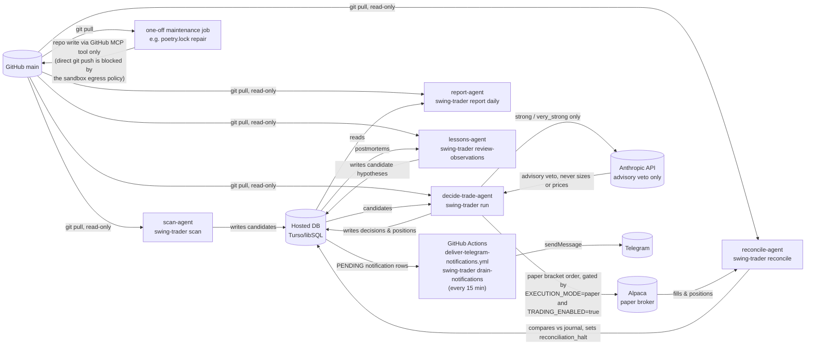

# Ultimate Swing Trader

Ultimate Swing Trader is a focused, long-only, AI-assisted swing-trading research and Alpaca paper-execution framework. Its purpose is to measure whether three deterministic setups have positive expectancy on an approximately $2,000 account. It is not a production or unattended real-money trading system.

Python owns setup classification, entry geometry, structural invalidation, target, risk, quantity, portfolio admission, and execution eligibility. Models may critique a valid candidate and veto it; they cannot create a setup, set a price, size a position, loosen a rule, or place an order.

## Supported architecture

The supported package is `src/swing/`, exposed only through `poetry run swing-trader`.

```text
versioned universe + daily bars + broker metadata
  -> deterministic scanner and setup validator
  -> strong-candidate LLM review (advisory veto only)
  -> unchanged deterministic strategy/risk validation
  -> serialized admission and whole-share Alpaca paper bracket
  -> broker/database reconciliation
  -> lifecycle, exit, journal, postmortem, and R analytics
```

The framework supports long U.S. equities and non-leveraged benchmark/sector ETFs only. Unsupported trading styles, short exposure, borrowed exposure, derivatives, digital assets, leveraged/inverse/volatility-linked ETFs, fractional shares, and averaging down have no supported switch or order path.

## The three setups

`TREND_PULLBACK` requires an established rising medium/long trend, positive SPY-relative strength, price above the medium average, a controlled pullback near short/medium support, no structural break, bullish continuation confirmation, acceptable ATR, liquidity, event data, and at least 2.0R to the deterministic target.

`BREAKOUT_RETEST` requires a sufficiently long and tight prior base, a buffered breakout with volume expansion, a controlled retest that holds resistance as support, bullish confirmation, positive trend, acceptable volatility/liquidity/event state, at least 2.0R, and no entry beyond the configured anti-chase ATR extension.

`RELATIVE_STRENGTH_CONTINUATION` requires strong stock-versus-SPY strength, nonnegative stock-versus-sector and sector-versus-SPY strength, aligned short/medium/long trends, a tight consolidation with volume contraction, price/volume confirmation, a non-hostile regime, acceptable liquidity/events, and at least 2.0R. Missing sector data rejects the setup.

Every condition is evaluated in `src/swing/strategy.py`. A failed condition has a stable reason code and cannot be rescued by score or model opinion.

## Scanner, universe, and data

The deterministic scanner uses the versioned universe snapshot in `config/universe/`, then applies the required blacklist, security type, existing-holding, price, history, share-volume, dollar-volume, spread, tradability, restriction, halt, freshness, and event filters. Scan results persist the universe/scanner/config versions and rejection funnel.

Alpaca supplies paper-account metadata, daily prices, quotes, and spreads. Alpaca's own asset metadata is not a reliable real-time halt feed, so halt status is cross-checked against NASDAQ's public regulatory trade-halts feed (`fetch_current_halts` in `src/swing/data_feed.py`); if that feed can't be fetched, halt status is unknown and the affected securities reject. Earnings lookup is cached and bounded. Missing, stale, malformed, conflicting, or unavailable safety-critical data rejects; there is no optimistic data fallback.

The holdings and wash-sale blacklist is `config/do_not_trade.yaml`. It intentionally ships empty and must be populated before a first paper cycle.

## LLM role

Only deterministically valid `strong` or `very_strong` candidates reach four structured roles: technical context, catalyst/fundamental risk, bear-case critic, and final proposal reviewer. Prompt payloads are explicit allowlists and omit credentials, account identifiers, buying power, broker IDs, and unrelated records.

Model schemas forbid entry, stop, target, quantity, position size, risk percentage, and limit overrides. Malformed output, timeout, unavailable/unconfigured model, unknown ticker, invalid setup, identity mismatch, `REJECT`, or `WATCH` becomes `NO_TRADE`.

## Risk model

Baseline risk is 0.75% of current equity. Python derives the structural stop from the validated setup and requires it to be 0.75–3.00 ATR below the fresh entry quote. Quantity is:

```text
floor((equity × applied risk percent) / (fresh quote − structural stop))
```

The result is then reduced, never increased, by cash, the 35% position-value ceiling, 2.00% total open risk, 1.50% sector risk, 1.00% cluster risk, and 0.10% of average daily volume. Quantity below one whole share rejects. Buying power cannot exceed cash in the sizing calculation.

Additional gates include a maximum of three open positions, one new position per day and three per week, 4% weekly drawdown halt, 8% portfolio drawdown halt, three-loss halt, global kill switch, five-session earnings exclusion, broader-event clearance, halt/restriction status, 0.50% maximum spread, 0.25R maximum chase, 2.0R minimum initial reward/risk, and duplicate/averaging-down prevention. Latches require explicit human review to clear.

## Execution and paper-to-live boundary

Alpaca paper is the only automated broker provider. An approved entry is one whole-share GTC limit bracket with broker-native stop and target legs. A deterministic client-order ID plus durable serialized reservation prevents duplicates. Partial fills, rejected orders, missing protection, ambiguous timeouts, restarts, and broker/database mismatches are reconciled fail-closed; unresolved truth latches new entries off.

Position state follows `OPEN -> PROTECTED -> PROFITABLE -> TRAILING -> EXIT_PENDING -> CLOSED`. Structural-only and structure-then-trail stop policies are named and bounded. Stops never widen. Expected and maximum hold windows are four and ten trading days by default. Manual paper closes are human-approved, idempotent requests followed by reconciliation.

Real capital is separate: `live-ticket` runs the same risk engine against a human-supplied snapshot and only prints a validated ticket. A human executes outside this repository. `record-live-fill` requires the unused approval, exact whole-share quantity, acceptable fill geometry, and proof of active stop and target; `record-live-exit` journals the result. No live order-placement endpoint or scheduled live connector exists.

## Journal, postmortems, and analytics

SQLite is the local durable system of record; Turso/libSQL is optional for ephemeral scheduled environments. Explicit forward migrations preserve existing rows. Entries, fill lots, immutable theses, lifecycle transitions, decisions, rejections, reconciliations, structured logs, notifications, daily bars, postmortems, and reports are durable and idempotent.

R uses actual entry fill risk against the immutable original stop. Partial exits retain the original denominator. Completed daily highs/lows produce MAE/MFE with explicit missing-data observations. Outcome is separate from process quality.

Analytics report expectancy, winner/loser R, median R, profit factor, cumulative-R drawdown, MAE/MFE, holding time, streaks, funnel losses, and configured benchmark statistics. Results are segmented by setup, regime, sector, score, hold, and volatility. Statistics are withheld below 30 closed trades overall or per segment.

## AutoResearch status

`src/autoresearch_swing/` records and evaluates hypotheses behind explicit sample and approval gates. No automatic bridge can promote its output into configuration; human review is mandatory for any research promotion. (An earlier, unrelated intraday-derived research tool that once lived at top-level `autoresearch/` was never swing-validated and has been removed; see `docs/refactor/01_AUDIT_REPORT.md` for its history.)

## Scheduling

Validated `America/New_York` schedule settings define deterministic scans at 09:35, 12:30, and 14:30 ET; the change-gated decision cycle at 10:15; position health/reconciliation at 15:45; daily reporting at 16:15; and Sunday lessons aggregation at 18:00. Each scheduled job allowlists exactly one `swing-trader` subcommand. No scheduled job attaches a live provider.

## Automation & agent topology

The five schedule slots above are not one long-running process — each is an independent scheduled cloud agent: its own isolated sandbox, its own fresh clone of `main`, allow-listed to exactly one `swing-trader` subcommand, and (aside from the reconciliation halt it may set) forbidden from editing `src/`, `tests/`, `docs/`, or `config/`. Agents never message each other directly; all coordination is indirect, through the hosted database.



Three distinct kinds of automation write to three distinct places, and none can touch either of the others' targets:

- **Trading agents** (`scan`, `run`, `reconcile`, `report`, `review-observations`) read code from GitHub but only ever write to the hosted database or, for `run` alone, to Alpaca's paper broker under an explicit environment gate. None of them has repo-write access, so a misbehaving trading agent cannot alter its own code or config.
- **Maintenance jobs** (one-off fix jobs such as the `poetry.lock` regeneration after a dependency cleanup) do the opposite: they edit the repo and touch neither the trading database nor the broker. Their sandbox blocks a plain `git push` to GitHub outright (the egress proxy returns `403` regardless of credentials); a repo write has to go through the GitHub MCP tool (`create_or_update_file` / `push_files`) instead, with a byte-for-byte hash check afterward since a single corrupted character in a lockfile is worse than no fix at all.
- **The notification relay** doesn't run in a Claude-hosted sandbox at all — it's a plain scheduled GitHub Actions workflow, because the sandboxes' egress policy also blocks outbound calls to `api.telegram.org` (confirmed via the proxy's own status endpoint: `connect_rejected`, "gateway answered 403 to CONNECT"). Trading agents already write every completed run's outcome to the hosted database as a durable, PENDING notification row regardless of whether delivery ever succeeds; this workflow is the only thing that actually drains that queue, since GitHub-hosted runners have normal outbound internet access. See `docs/CRON_AGENTS.md`'s "Known limitations" for the full story.

## Configuration and secrets

`.env.example` is the reference template. The supported package reads the process environment; it does not automatically load or create `.env`. `src/swing/config.py` is the single settings model for execution, scanner, setups, regime, risk, events, freshness, liquidity, scheduling, LLM roles, broker mode, and research thresholds. Invalid types and attempts to exceed a hard ceiling/floor fail startup and name the parameter.

Secrets remain boundary-only environment values. They are never included in settings snapshots, prompts, trade rows, logs, notifications, reports, or CLI errors. Persistence recursively redacts sensitive keys and recognized token forms. `.env*`, credentials, private keys, databases, logs, caches, and runtime output are gitignored; `.env.example` is the only exception.

## Commands

```bash
poetry install
poetry run swing-trader init-db
poetry run swing-trader status
poetry run swing-trader scan
poetry run swing-trader run
poetry run swing-trader positions
poetry run swing-trader reconcile
poetry run swing-trader analytics
poetry run swing-trader drain-notifications
poetry run swing-trader report daily
poetry run swing-trader report weekly
poetry run swing-trader paper-review intent.json
poetry run swing-trader tighten-stop TRADE_ID BROKER_STOP_ORDER_ID NEW_STOP
poetry run swing-trader close TRADE_ID --approved-by NAME --reason "safety reason"
poetry run swing-trader live-ticket snapshot.json
poetry run swing-trader record-live-fill fill.json
poetry run swing-trader record-live-exit TRADE_ID EXIT_PRICE --reason "broker fill"
```

`scan`, `status`, `positions`, `analytics`, `drain-notifications`, and reports do not place orders. `drain-notifications` only attempts delivery of already-durable notification rows; it never reads or writes trading state. `run` can place Alpaca paper orders only when `EXECUTION_MODE=paper`, `TRADING_ENABLED=true`, every deterministic gate passes, and reconciliation is clean. `paper-review --submit`, `tighten-stop`, and `close` are explicit paper mutations; review their help and safety state before use.

## Tests

```bash
poetry run pytest
poetry run black --check src/swing tests/swing
poetry run isort --check-only src/swing tests/swing
poetry run flake8 src/swing tests/swing --max-line-length=420 --extend-ignore=E203
npx --no-install pyright
```

Tests mock every broker, LLM, market-data, earnings, and hosted-database boundary. No test requires credentials or network access.

## Before any paper cycle

1. Use Python 3.11–3.13 and complete `poetry install`; initialize a fresh local database and run the full validation suite.
2. Populate and review `config/do_not_trade.yaml`, then verify the versioned universe, earnings, broader-event, and real-time halt data are complete and fresh.
3. Perform credentialed read-only Alpaca QA, then manually verify paper bracket, partial-fill, stop/target, timeout, restart, and reconciliation payload behavior before enabling paper submission.

Until those checks pass, the honest readiness verdict is **not ready for a first autonomous paper cycle**.

## Safety philosophy

Unknown is not safe. Missing data rejects. Models can veto but cannot authorize. Risk is based on the immutable original structure. Whole-share rounding never increases risk. Broker truth is reconciled before trust. Live execution remains human-only. A control that reduces trade count is evidence of the framework working, not a reason to remove it.

Historical provenance: this repository began as an AI hedge-fund/personality-agent project and later carried multiple trading styles. Those earlier components have been removed; the operational framework described above is the sole supported system. Provenance is recoverable via `docs/refactor/01_AUDIT_REPORT.md` and git history.

This project is research software, not financial advice.

## License

All rights reserved — see [LICENSE](LICENSE). Public visibility is for reference only and does not grant permission to use, copy, or redistribute this code.
