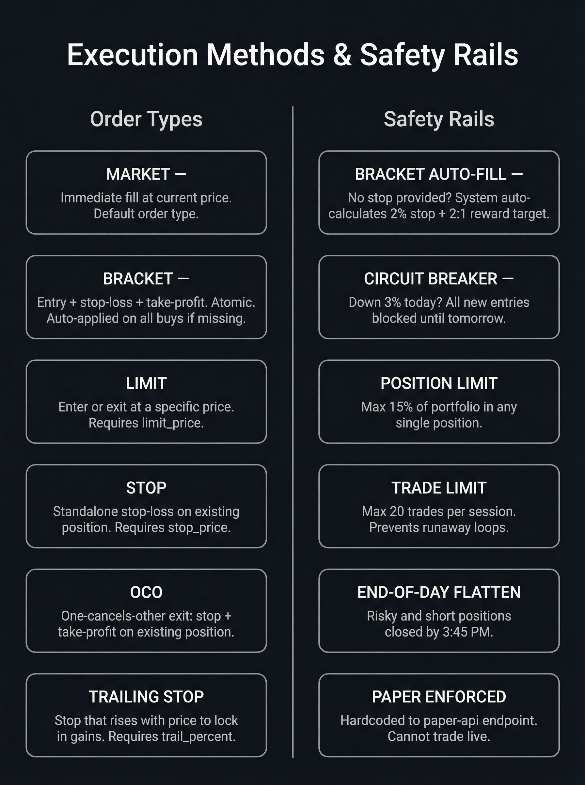

# Swarm Trader

> **Adaptive swing status:** the supported production architecture is now selective, long-only swing trading. Day trading, automatic mode switching, shorts, leverage, margin, options, crypto, and legacy personality-swarm execution are disabled. The older dual-mode sections below are retained as historical/reference documentation and are not an execution guide.

## Adaptive Swing Quick Start

The experiment is designed to test whether a roughly $2,000 account has repeatable positive expectancy while protecting capital. Code is the risk authority; models only produce structured analysis and proposals. Safe defaults are `EXECUTION_MODE=paper` and `TRADING_ENABLED=false`.

```bash
# Install
poetry install
cp .env.example .env

# Initialize durable SQLite memory and inspect safety state
poetry run swing-trader init-db
poetry run swing-trader status

# Test the complete repository
poetry run pytest

# Autonomous daily cycle: scan the market, analyze with Claude, decide, paper-trade
poetry run swing-trader scan   # scan + regime only, no LLM calls, no execution
poetry run swing-trader run    # full scan -> Claude pipeline -> risk gate -> Alpaca paper order

# Review analytics and persist reports
poetry run swing-trader analytics
poetry run swing-trader report daily
poetry run swing-trader report weekly
```

Configure model roles with `ANALYST_MODEL`, `PORTFOLIO_MANAGER_MODEL`, `POSTMORTEM_MODEL`, and `RESEARCH_MODEL`; empty/unavailable roles fail to `NO_TRADE`. The broad universe (`src/swing/universe.py`) is reduced by deterministic daily OHLCV/liquidity/setup scoring before model analysis. Only `TREND_PULLBACK`, `BREAKOUT_RETEST`, and `RELATIVE_STRENGTH_CONTINUATION` are valid setup types.

To review a paper intent manually, create a JSON file with schema-valid `candidate` and `proposal` objects, configure Alpaca paper credentials, and run:

```bash
# Review only; no order
poetry run swing-trader paper-review intent.json

# Paper submission requires this explicit switch
EXECUTION_MODE=paper TRADING_ENABLED=true poetry run swing-trader paper-review intent.json --submit

# Reconcile broker truth with SQLite (required before every real submission and after restarts)
poetry run swing-trader reconcile
```

Never set live mode during initial QA. Live mode additionally requires `LIVE_TRADING_ACK=I_ACKNOWLEDGE_LIVE_RISK`, verified broker/account identity, and every item in [the paper-to-live checklist](docs/PAPER_TO_LIVE_CHECKLIST.md). Robinhood's Agentic Trading MCP is real (`claude mcp add robinhood-trading --transport http https://agent.robinhood.com/mcp/trading`) but has no paper/sandbox mode and is scoped for a human-supervised session, not a headless credential — see [docs/ROBINHOOD_MCP.md](docs/ROBINHOOD_MCP.md). This framework never places a live order automatically: `swing-trader live-ticket` runs the same unchanged risk engine against a human-supplied real account snapshot and prints an approved ticket for a human to execute themselves; `swing-trader record-live-fill`/`record-live-exit` journal the result afterward.

The legacy `portfolio_monitor.py` is intentionally disabled and cannot read an account or place sells. Protective exits are broker-native GTC bracket legs; amendments must use `swing-trader tighten-stop`, and closure detection/postmortems run through `swing-trader reconcile`.

Code-level remediation is complete and the local suite passes, but paper-account activation still requires real Alpaca credential QA, a populated holdings blacklist, verified universe/earnings/halt data, and the broker-behavior checks in the checklist. Live execution requires the human-supervised Robinhood workflow above; nothing in this repository places a live order on its own.

Key documentation: [architecture](docs/ADAPTIVE_SWING_ARCHITECTURE.md), [remediation status](docs/REMEDIATION_STATUS.md), [risk model](docs/RISK_MODEL.md), [learning engine](docs/LEARNING_ENGINE.md), [swing AutoResearch](docs/AUTORESEARCH_SWING.md), [broker providers](docs/BROKER_PROVIDERS.md), and [experiment protocol](docs/EXPERIMENT_PROTOCOL.md).

## How the Framework Works

### Design pattern: code is the risk authority, models only advise

Every decision that can lose money is made by deterministic Python, not an
LLM. Models (`src/swing/agents.py`, `src/swing/llm_backend.py`) only ever
produce *structured proposals* — a candidate ticker, a setup type, a bull/bear
case — never a final "do it." Every proposal passes through
`src/swing/risk.py` and `src/swing/execution.py` before anything reaches a
broker, and those modules enforce hard, config-validated ceilings (position
size, sector exposure, daily/weekly entry limits, drawdown and loss-streak
halts, a global kill switch) that no prompt or model output can weaken —
`src/swing/config.py`'s `SwingSettings.__post_init__` actively rejects
startup if any risk parameter is configured looser than its immutable floor.
If a model's role has no configured backend, or returns something that
doesn't validate against its schema, the result is `NO_TRADE` — never a
fallback guess.

This produces one linear pipeline, run in order, every time:

```
Alpaca (bars) + yfinance (earnings, bounded timeout)
    │
    ▼
DeterministicSwingScanner            src/swing/market.py
  scores the universe purely on math — trend, relative
  strength, volume, setup quality, event risk — no LLM here
    │
    ▼
AgentPipeline                        src/swing/agents.py
  only the candidates that already cleared the score
  threshold get LLM analysis: technical + fundamental reads,
  a bull case, a bear case, a portfolio-manager verdict
    │
    ▼
SwingRiskManager + SwingExecutionService   risk.py / execution.py
  re-checks kill switch / halts / position limits / open-risk
  from the database on every single call — sizes the position,
  sets the hard stop and target, rejects anything over a ceiling
    │
    ▼
Broker
  Alpaca (paper) → autonomous, no human step
  Robinhood (live) → human-supervised only, see below
```

### The daily agent fleet

Rather than one script doing everything, the daily cycle is split into five
independent scheduled cloud agents ("routines"), each with one job and its
own schedule (see `docs/CRON_AGENTS.md` for the full rationale and known
limitations):

| Agent | Runs | Job |
|---|---|---|
| **scan-agent** | 9:35am ET, weekdays | Pure market scan — finds candidates, no LLM calls, no orders |
| **decide-trade-agent** | 10:03am ET, weekdays | Re-scans, runs LLM analysis, submits paper orders if `TRADING_ENABLED=true` |
| **reconcile-agent** | 3:55pm ET, weekdays | Confirms Alpaca's broker state matches the journal; halts on any mismatch |
| **report-agent** | 4:15pm ET, weekdays | Reads the day's state and writes a daily report |
| **lessons-agent** | Sundays | Aggregates closed-trade postmortems into candidate research hypotheses — never auto-validates |

Splitting it this way means a failure in one step (say, a broker hiccup
during reconciliation) can't silently corrupt or block an unrelated step
(the next day's scan), and each agent's blast radius is limited to exactly
the one `swing-trader` subcommand it's allowed to run — every agent's prompt
explicitly lists every *other* command as forbidden.

### State: a hosted database, not git

Each agent fires in a fresh, disposable cloud sandbox with no persistent
disk — nothing survives between runs except by leaving the sandbox somehow.
`SwingDatabase` (`src/swing/database.py`) solves this by connecting to a
hosted Turso (libSQL) database when `TURSO_DATABASE_URL` is set, so every
`swing-trader` command reads and writes live, shared state directly — the
kill switch, drawdown/loss-streak halts, the full trade journal, candidate
scores, and postmortem lessons all persist automatically with no separate
save step. (Locally, with that variable unset, it falls back to a plain
SQLite file — local development and the test suite never touch Turso.) An
earlier design tried committing the database file back to git after every
run instead; that turned out not to work at all, since cloud routine
sessions have no functioning git-push credentials regardless of file size —
see `docs/CRON_AGENTS.md` for the full story.

### Live trading is human-supervised by design, not by accident

`decide-trade-agent` can run completely unattended — but only against
Alpaca's **paper** account. Real-money execution goes through a deliberately
different, non-automatable path: `swing-trader live-ticket` runs the exact
same risk engine against a human-typed real account snapshot and prints an
approved order ticket; a human then places that order themselves in the
Robinhood app, and `record-live-fill`/`record-live-exit` journal what
actually happened afterward. Nothing in this codebase calls a live
order-placement endpoint, and the daily routines never have Robinhood's MCP
connector attached — see [docs/ROBINHOOD_MCP.md](docs/ROBINHOOD_MCP.md) for
why that boundary exists and stays fixed even though the integration is
technically capable of more.

## Legacy Reference Below — Non-operational

Everything below this heading describes the imported predecessor and is retained only for provenance. Its commands, day/short modes, risk numbers, monitors, and cron examples are not supported operating instructions. Use only the adaptive swing commands above and the current checklist.

Multi-agent AI trading system with **two autonomous modes** — swing trading and intraday day trading. 20 analyst agents (13 LLM-powered investor personalities + 7 data/quant specialists) independently analyze stocks. A Portfolio Manager aggregates their signals. Trades execute on Alpaca paper trading through a **code-enforced risk management layer** that no agent can override.

**Multi-provider LLM support** — 13 providers: OpenAI, Anthropic, Google, DeepSeek, Groq, Ollama, xAI, OpenRouter, Azure OpenAI, GigaChat, Alibaba, Meta, Mistral.

**Zero paid data APIs required.** Hybrid data layer uses SEC EDGAR + yfinance. Works fully free out of the box.

> Built on [virattt/ai-hedge-fund](https://github.com/virattt/ai-hedge-fund), extended with dual-mode trading, code-enforced risk management, free data sources, Alpaca execution, custom agents, and autonomous strategy evolution.

---

## What's Different

| Feature | Upstream | Swarm Trader |
|---|---|---|
| LLM providers | Single provider | **13 providers (Ollama, OpenAI, Anthropic, Google, etc.)** |
| Financial data | financialdatasets.ai ($200/mo) | **Hybrid: SEC EDGAR + yfinance (free)** |
| Trade execution | Simulated only | **Alpaca paper trading — market, limit, bracket, OCO, trailing stop** |
| Trading modes | Single mode | **Dual-mode: swing + day with autonomous switching** |
| Risk management | Basic | **Code-enforced risk manager — hard stops, circuit breakers, position limits** |
| Mode steering | N/A | **`trading_mode.json` — agent decides or human overrides** |
| Performance tracking | None | **Daily snapshots, SPY/QQQ comparison, Sharpe ratio** |
| Short selling | Not supported | **Full short selling support** |
| Analyst agents | 12 built-in | **20 agents (12 + apex + market regime + 6 data/quant)** |
| Custom agents | Not supported | **Create your own analyst agents** |
| Automation | Manual runs | **3-cron autonomous pipeline** |
| Strategy evolution | None | **AutoResearch loop — AI evolves strategy.py overnight** |

---

## Dual-Mode Architecture

The system operates in two clearly separated modes with **separate Alpaca accounts** — each mode trades its own book. Every script accepts `--mode swing|day`, routes to the correct account automatically, and reads mode-specific configuration from a single source of truth in `src/config.py`.

### Mode Selection

The agent autonomously picks its mode each morning, or a human can override:

```
Priority order:
  1. --mode CLI flag              (cron or manual override)
  2. override in trading_mode.json (human steering with optional expiry)
  3. mode field in trading_mode.json (auto / swing / day)
  4. TRADING_MODE env var          (fallback)
  5. Default: swing               (safe baseline)
```

**`trading_mode.json`** — the steering file:

```json
{
  "mode": "auto",
  "override": null,
  "override_until": null,
  "auto_rules": {
    "prefer_day_when": ["VIX > 25", "Major earnings/FOMC day", "Morning gap >1%"],
    "prefer_swing_when": ["VIX < 20", "Strong trend in core positions", "Default"]
  }
}
```

When `mode` is `"auto"`, the agent checks VIX, pre-market gaps, and the economic calendar at market open and picks the appropriate mode. Humans can override anytime:

```python
# Human override: day mode for 4 hours
from src.config import set_mode
set_mode("day", reason="FOMC day", updated_by="human", override=True, override_hours=4)

# Or just edit trading_mode.json directly
```

### Multi-Account Routing

Each trading mode operates on its own Alpaca paper trading account. This provides clean separation — swing positions don't interfere with day trades, each account has its own equity and P&L tracking, and risk limits are enforced per-account.

| Mode | Account | Purpose |
|---|---|---|
| `swing` | Primary account | Multi-day holds, conservative risk |
| `day` | Day trading account | Intraday only, flattens EOD |

Credentials are configured in `.env`:

```bash
# Primary / Swing account (required)
ALPACA_API_KEY=your_swing_key
ALPACA_API_SECRET=your_swing_secret

# Day trading account (optional — falls back to primary if not set)
ALPACA_DAY_API_KEY=your_day_key
ALPACA_DAY_API_SECRET=your_day_secret
```

Account routing is handled by `src/accounts.py` — all API calls automatically use the correct credentials based on the `--mode` flag. If only one account is configured, both modes share it (backward compatible).

```python
from src.accounts import get_account_for_mode

acct = get_account_for_mode("swing")  # returns AlpacaAccount with correct keys
acct.headers  # ready-to-use API headers
```

### Recommended: Separate Trading Agents

For best results, run a **dedicated agent per account** rather than one agent switching modes. Each agent develops its own context, memory, and trading style:

| Agent | Role | Account | Schedule |
|---|---|---|---|
| Swing agent | Multi-day positions, sector rotation | Primary | 3 crons: 9:30 AM, 12 PM, 3 PM |
| Day agent | Intraday scalps, flat by close | Day trading | 3 crons: 6:30 AM, 9:30 AM, 12:45 PM |

This provides complete isolation — separate P&L, separate risk management, no cross-contamination between strategies. See [Automation with OpenClaw](#automation-with-openclaw) for cron setup.

### Swing Mode

Position trading over days to weeks. Diversified universe with conservative risk limits.

| Parameter | Value |
|---|---|
| Universe | Core Tech, Growth, Value/Dividend, Tactical, Hedge (28 tickers) |
| Max position | 8% of equity |
| Max sector | 30% |
| Stop loss | -7% hard stop |
| Trailing stop | 15% from peak |
| Max trades/day | 4 |
| Max positions | 12 |
| Cash reserve | Min 20% |
| Leveraged ETFs | ❌ Banned |
| Overnight holds | ✅ Yes |
| Circuit breaker | -2% daily, -5% weekly |

**Swing universe:**

| Sector | Tickers | Max Allocation |
|---|---|---|
| Core Technology | NVDA, AVGO, TSM, MSFT, AAPL, GOOGL, META, AMZN | 30% |
| Growth | PLTR, AMD, CRM, SNOW, NET, PANW | 25% |
| Value & Dividend | JPM, V, UNH, JNJ, PG, KO | 25% |
| Tactical | COIN, MSTR, RKLB, SMCI | 15% |
| Hedge | SPY, QQQ, GLD, TLT | 15% |

### Day Trading Mode

Intraday trading with tighter stops, larger positions, and mandatory end-of-day flatten.

| Parameter | Value |
|---|---|
| Universe | Mega-Cap, Momentum, ETF Direction (18 tickers) |
| Max position | 15% of equity |
| Max sector | 50% |
| Stop loss | -1.2% tight stop |
| Trailing stop | 3% from intraday high |
| Max trades/day | 20 |
| Max positions | 8 |
| Cash reserve | Min 10% |
| Leveraged ETFs | ✅ Allowed (intraday only) |
| Overnight holds | ❌ Flattens by 3:45 PM ET |
| Circuit breaker | -3% daily, -8% weekly |

**Day universe:**

| Sector | Tickers | Max Allocation |
|---|---|---|
| Mega-Cap Liquid | NVDA, AVGO, TSM, AMD, MSFT, AAPL, META, GOOGL, AMZN | 50% |
| Momentum | PLTR, COIN, MSTR, RKLB, SMCI | 35% |
| ETF Direction | SPY, QQQ, TQQQ, SOXL | 30% |

**Day trading features:**
- **5-min intraday bars** from Alpaca market data API
- **VWAP** — volume-weighted average price
- **RSI(14)** on 5-min timeframe
- **Volume ratio** — today's volume vs 20-day average
- **Dynamic market scanner** (`scan_market.py`) — discovers today's movers
- **Market regime detection** — trending, range-bound, or volatile
- **Historical only:** the old EOD-flatten monitor is disabled and submits no orders

---

## Architecture


```
trading_mode.json        →  Agent picks swing or day mode
    ↓
Market Scanner + Portfolio State
    ↓
Data Agents (6 quant) + LLM Analysts (13 personalities) + Market Regime
    ↓
Portfolio Manager (aggregates signals, sizes positions)
    ↓
risk_manager.py          →  Code-enforced validation (rejects rule violations)
    ↓
execute_trades.py        →  Alpaca bracket orders with mandatory stops
    ↓
swing-trader reconcile   →  Reconciles bracket legs/fills and runs closure postmortems
    ↓
performance_tracker_v2.py →  Daily snapshots, Sharpe ratio, alpha tracking
```

---

## Risk Management (V2)

The risk manager (`risk_manager.py`) enforces **11 hard rules** that no agent can bypass. Every trade proposal passes through `validate_trade()` before execution. Violations are rejected with a clear reason.

### Rules (Code-Enforced)

| # | Rule | Swing | Day |
|---|---|---|---|
| 1 | No leveraged ETFs | ❌ Hard block | ✅ Allowed intraday |
| 2 | No moonshots (IONQ, RGTI, etc.) | ❌ Hard block | ❌ Hard block |
| 3 | Daily loss circuit breaker | -2% | -3% |
| 4 | No new buys if down for day | -3% | -2% |
| 5 | Weekly loss circuit breaker | -5% | -8% |
| 6 | Max trades per day | 4 | 20 |
| 7 | Max open positions | 12 | 8 |
| 8 | Min cash reserve | 20% | 10% |
| 9 | Max position size | 8% | 15% |
| 10 | Max sector allocation | 30% | 50% |
| 11 | Tactical/high-risk cap | 3% total | No cap |

### Mandatory Stop Losses

Every buy order automatically gets a bracket order with a stop loss:
- **Swing:** -7% hard stop from entry + 15% trailing stop from peak
- **Day:** -1.2% hard stop + 3% trailing stop from intraday high

`portfolio_monitor.py` is now a fail-closed compatibility shim. It never reads the account or submits an order.

### Status Check

```bash
# See current risk status for either mode
poetry run python risk_manager.py --status --mode swing
poetry run python risk_manager.py --status --mode day
```

---

## Performance Tracking

`performance_tracker_v2.py` tracks daily performance against SPY and QQQ benchmarks.

```bash
# Take today's snapshot
poetry run python performance_tracker_v2.py --snapshot

# View performance report
poetry run python performance_tracker_v2.py --report

# JSON output for automation
poetry run python performance_tracker_v2.py --report --json
```

Tracks:
- Daily equity snapshots saved to `snapshots/YYYY-MM-DD.json`
- SPY and QQQ comparison (daily alpha)
- Rolling 21-day Sharpe ratio
- Win rate, average win/loss, profit factor (from trade journal)

---

## AutoResearch — Strategy Evolution Lab

> Adapted from [karpathy/autoresearch](https://github.com/karpathy/autoresearch) — Andrej Karpathy's autonomous AI research framework. We applied the same loop to trading strategy evolution.

An AI agent modifies `strategy.py` (pure Python — indicators, thresholds, signal logic), runs a fast backtest, measures fitness, keeps or reverts. ~50 experiments per overnight run.

| | Karpathy's autoresearch | Swarm Trader AutoResearch |
|---|---|---|
| What evolves | `train.py` (PyTorch training) | `strategy.py` (intraday trading rules) |
| Metric | `val_bpb` (validation loss) | Fitness = Sharpe×0.35 + Sortino×0.25 + Return%×0.20 + WinRate×0.10 + ProfitFactor×0.10 |
| Budget | 5-min GPU training run | Fast backtest on cached 5-min bars (~30s) |
| Agent | Claude Code | Claude Code (pinned to Sonnet) |

### Quick Start

```bash
# Cache historical data (one-time)
poetry run python autoresearch/backtest_fast.py --days 10

# Run baseline backtest
poetry run python autoresearch/backtest_fast.py

# Kick off evolution (25 iterations)
poetry run python autoresearch/evolve.py --iterations 25

# Review results
poetry run python autoresearch/analyze.py
```

### Files

| File | Role | Modified by |
|------|------|-------------|
| `autoresearch/strategy.py` | Pure-Python strategy (tunable params) | Agent |
| `autoresearch/backtest_fast.py` | Deterministic backtester + fitness scorer | Nobody |
| `autoresearch/evolve.py` | Evolution loop orchestrator | Nobody |
| `autoresearch/analyze.py` | Cross-run analytics | Nobody |
| `autoresearch/program.md` | Agent instructions | Human |
| `autoresearch/experiments/log.jsonl` | Full experiment history | System |

### From Research to Production

AutoResearch and live trading are **intentionally decoupled** — no auto-bridge. This is a safety feature.

1. Review `experiments/log.jsonl` — see what improved fitness
2. Decide if the finding is real alpha or overfitting
3. Manually update `src/config.py` or agent prompts
4. Monitor live performance after the change

---

## Data Sources

| Data Type | Source | Mode | Cache TTL |
|---|---|---|---|
| Prices (OHLCV) | yfinance | swing | 15 min |
| 5-min intraday bars | Alpaca market data API | day | none (live) |
| VWAP / RSI / volume | Calculated from bars | day | none |
| Financial metrics | yfinance + SEC EDGAR XBRL | swing | 24 hrs |
| Insider trades | SEC EDGAR Form 4 | swing | 7 days |
| Company news | yfinance news feed | both | 15 min |

---

## Quick Start

### Prerequisites

- Python 3.11+
- [Poetry](https://python-poetry.org/)
- [Alpaca](https://app.alpaca.markets) paper trading account (free)
- At least one LLM provider configured

### Setup

```bash
git clone https://github.com/zhound420/swarm-trader.git
cd swarm-trader
poetry install

cp .env.example .env
```

Edit `.env`:

```bash
# Required — Alpaca paper trading (primary / swing account)
ALPACA_API_KEY=your_key_here
ALPACA_API_SECRET=your_secret_here

# Optional — Separate day trading account
# If set, day mode trades on this account. If not, both modes share the primary.
ALPACA_DAY_API_KEY=your_day_key_here
ALPACA_DAY_API_SECRET=your_day_secret_here

# LLM provider (at least one)
OPENAI_API_KEY=
ANTHROPIC_API_KEY=
GOOGLE_API_KEY=
GROQ_API_KEY=
DEEPSEEK_API_KEY=

# Optional — trading mode (default: swing)
TRADING_MODE=auto
```

### Verify

```bash
# Test data layer
python test_data.py --ticker NVDA

# Check risk manager
poetry run python risk_manager.py --status --mode swing
```

### Run (Swing Mode)

```bash
# Analyze holdings
poetry run python run_hedge_fund.py --mode swing

# Execute trades (risk manager validates each one)
poetry run python run_hedge_fund.py --mode swing --execute

# Check portfolio
poetry run python check_portfolio.py --mode swing

# Reconcile durable trades, broker positions, orders, and fills
poetry run swing-trader reconcile

# Rebalance — sell anything outside the swing universe
poetry run python rebalance.py --mode swing
```

### Run (Day Trading Mode)

```bash
# Scan for opportunities
TICKERS=$(poetry run python scan_market.py --max 25)

# Gather intraday data
poetry run python gather_data.py --mode day --tickers $TICKERS --output /tmp/data.json

# Execute trades
echo '{"trades":[{"ticker":"NVDA","action":"buy","qty":10}]}' | \
  poetry run python execute_trades.py --mode day

# Flatten all positions (end of day)
poetry run python execute_trades.py --flatten

# Market pulse check
poetry run python check_moves.py --mode day
```

---

## Order Types



| Type | When to use | Key fields |
|---|---|---|
| `market` | Default — fill immediately | — |
| `limit` | Enter/exit at a specific price | `limit_price` |
| `bracket` | Entry with automatic stop + target | `stop_price`, `take_profit` |
| `stop` | Standalone stop-loss on existing position | `stop_price` |
| `oco` | Exit-only: stop + take-profit on existing | `stop_price`, `take_profit` |
| `trailing_stop` | Stop that rises with price | `trail_percent` |

In swing mode, every buy automatically gets a bracket order with -7% stop. In day mode, stops are managed by the portfolio monitor.

---

## Analyst Agents

### LLM Agents (13)

| Agent | Philosophy |
|---|---|
| `warren_buffett` | Value investing, moats, margin of safety |
| `charlie_munger` | Quality at fair prices |
| `michael_burry` | Contrarian deep value, FCF |
| `cathie_wood` | Disruptive innovation |
| `peter_lynch` | Growth at reasonable price |
| `bill_ackman` | Activist, concentrated positions |
| `stanley_druckenmiller` | Macro, asymmetric bets |
| `ben_graham` | Deep value, net-nets |
| `phil_fisher` | Qualitative growth |
| `aswath_damodaran` | DCF valuation |
| `rakesh_jhunjhunwala` | Emerging market growth |
| `mohnish_pabrai` | Dhandho framework |
| `mordecai` | **Mode-aware contrarian** — disciplined, rules-based, pulls universe from active mode |

### Data/Quant Agents (7)

| Agent | What it does |
|---|---|
| `fundamentals_analyst` | ROE, margins, P/E, P/B |
| `technical_analyst` | Trend, momentum, volatility |
| `sentiment_analyst` | Market sentiment |
| `growth_analyst` | Revenue acceleration, R&D |
| `valuation_analyst` | Fair value models |
| `news_sentiment_analyst` | News-driven sentiment signals |
| `market_regime` | Classifies conditions: trending, range-bound, volatile |

### Custom Agents

Create your own — see `src/agents/mordecai.py` as a template. Register in `src/utils/analysts.py`. Full guide in [PLAYBOOK.md](./PLAYBOOK.md).

---

## Automation with OpenClaw

The system runs fully autonomous via [OpenClaw](https://github.com/openclaw/openclaw) cron jobs. The recommended setup uses **two dedicated agents** — one for swing, one for day trading — each with their own cron schedule and account.

### Two-Agent Setup (Recommended)

| Time (PT) | Agent | Job | Purpose |
|---|---|---|---|
| 6:30 AM | Day trader | `day-morning` | Pre-market scan, VIX check, identify targets |
| 9:30 AM | Swing trader | `swing-morning` | Health check, run stops, take snapshot |
| 9:30 AM | Day trader | `day-midday` | Position check, afternoon trades |
| 12:00 PM | Swing trader | `swing-midday` | Analysis, propose and execute trades |
| 12:45 PM | Day trader | `day-flatten` | **Mandatory flatten** — close all positions, EOD report |
| 3:00 PM | Swing trader | `swing-afternoon` | EOD review, final stops, performance report |

### Swing Agent Crons

```bash
# Morning health check (9:30 AM Mon-Fri)
openclaw cron add --name swing-morning \
  --cron "30 9 * * 1-5" --tz "America/Los_Angeles" --exact \
  --agent swing-agent \
  --model "your-model" \
  --session isolated \
  --announce --channel telegram --to YOUR_CHAT_ID \
  --best-effort-deliver \
  --message 'Morning health check.
    1. Run: poetry run swing-trader reconcile
    2. Run: poetry run python risk_manager.py --status --mode swing
    3. Run: poetry run python performance_tracker_v2.py --snapshot --force
    4. Brief report: equity, stops triggered, SPY comparison.'

# Midday analysis (12:00 PM Mon-Fri)
openclaw cron add --name swing-midday \
  --cron "0 12 * * 1-5" --tz "America/Los_Angeles" --exact \
  --agent swing-agent \
  --model "your-model" \
  --session isolated \
  --announce --channel telegram --to YOUR_CHAT_ID \
  --best-effort-deliver \
  --message 'Midday analysis.
    1. Gather data: poetry run python gather_data.py
    2. Analyze universe stocks for swing mode
    3. Execute: echo trades | poetry run python execute_trades.py --mode swing
    4. Report: trades executed, rejections from risk manager.'

# Afternoon review (3:00 PM Mon-Fri)
openclaw cron add --name swing-afternoon \
  --cron "0 15 * * 1-5" --tz "America/Los_Angeles" --exact \
  --agent swing-agent \
  --model "your-model" \
  --session isolated \
  --announce --channel telegram --to YOUR_CHAT_ID \
  --best-effort-deliver \
  --message 'Afternoon review.
    1. Run: poetry run swing-trader reconcile
    2. Run: poetry run python performance_tracker_v2.py --snapshot --force
    3. EOD report: daily P&L, alpha vs SPY, overnight positions.'
```

### Day Trading Agent Crons

```bash
# Pre-market scan (6:30 AM Mon-Fri)
openclaw cron add --name day-morning \
  --cron "30 6 * * 1-5" --tz "America/Los_Angeles" --exact \
  --agent day-agent \
  --model "your-model" \
  --session isolated \
  --announce --channel telegram --to YOUR_CHAT_ID \
  --best-effort-deliver \
  --message 'Pre-market scan.
    1. Check VIX and economic calendar
    2. Run: poetry run python scan_market.py --max 25 --json
    3. Run: poetry run python gather_data.py --mode day
    4. Report: VIX level, top targets with entry zones, caution flags.'

# Midday position check (9:30 AM Mon-Fri)
openclaw cron add --name day-midday \
  --cron "30 9 * * 1-5" --tz "America/Los_Angeles" --exact \
  --agent day-agent \
  --model "your-model" \
  --session isolated \
  --announce --channel telegram --to YOUR_CHAT_ID \
  --best-effort-deliver \
  --message 'Midday check.
    1. Day mode is disabled; do not run this legacy cron
    2. Cut dead money, look for afternoon setups
    3. Execute if setups confirm: echo trades | poetry run python execute_trades.py --mode day
    4. Report: open positions + P&L, stops triggered.'

# Mandatory EOD flatten (12:45 PM Mon-Fri)
openclaw cron add --name day-flatten \
  --cron "45 12 * * 1-5" --tz "America/Los_Angeles" --exact \
  --agent day-agent \
  --model "your-model" \
  --session isolated \
  --announce --channel telegram --to YOUR_CHAT_ID \
  --best-effort-deliver \
  --message 'FLATTEN — 15 min to close.
    1. Run: poetry run python execute_trades.py --mode day --flatten
    2. Day mode is disabled; do not run this legacy cron
    3. Run: poetry run python performance_tracker_v2.py --snapshot --force
    4. EOD report: daily P&L, win rate, best/worst trade, alpha vs SPY.'
```

**AutoResearch crons** (optional, after market close):

```bash
# Evolution run (5:00 PM Mon-Fri)
openclaw cron add --name autoresearch-run \
  --cron "0 17 * * 1-5" \
  --agent my-agent \
  --model "google/gemini-2.5-flash" \
  --session isolated \
  --timeout 10800 \
  --message "cd ~/swarm-trader && poetry run python autoresearch/evolve.py --iterations 50"

# Results report (8:00 PM Mon-Fri)
openclaw cron add --name autoresearch-report \
  --cron "0 20 * * 1-5" \
  --agent my-agent \
  --model "google/gemini-2.5-flash" \
  --session isolated \
  --announce --channel telegram \
  --message "Read /tmp/autoresearch-latest.log. Summarize: experiments, best fitness, top findings."
```

### Managing Crons

```bash
openclaw cron list                        # See all jobs
openclaw cron run swarm-morning           # Trigger manually
openclaw cron disable swarm-midday        # Pause a job
openclaw cron enable swarm-midday         # Resume
openclaw cron rm <job-id>                 # Delete
```

---

## CLI Reference

All scripts support `--mode swing|day`. Mode defaults to the resolved value from `trading_mode.json`.

### Core Scripts

| Script | Purpose | Key Flags |
|---|---|---|
| `run_hedge_fund.py` | Multi-agent analysis + execution | `--execute`, `--tickers`, `--mode`, `--show-reasoning` |
| `gather_data.py` | Market data gathering | `--mode`, `--tickers`, `--top N`, `--output` |
| `execute_trades.py` | Trade execution with risk validation | `--mode`, `--file`, `--flatten`, `--dry-run` |
| `risk_manager.py` | Risk status check | `--status`, `--mode` |
| `portfolio_monitor.py` | Disabled fail-closed compatibility shim | no broker actions |
| `performance_tracker_v2.py` | Daily snapshots + benchmarking | `--snapshot`, `--report`, `--json`, `--days N` |
| `check_portfolio.py` | Quick portfolio overview | `--mode`, `--telegram`, `--json` |
| `check_moves.py` | Universe pulse check | `--mode` |
| `rebalance.py` | Sell non-universe positions | `--mode`, `--execute` |
| `scan_market.py` | Dynamic ticker discovery | `--max N`, `--min-price`, `--json` |
| `trade_alerts.py` | Anomaly detection | `--check`, `--mode`, `--telegram` |
| `trade_journal.py` | Trade history + stats | `--show`, `--stats`, `--ticker` |
| `intel_exchange.py` | Peer signal sharing via A2A | `--mode`, `--dry-run`, `--json` |

---

## Project Structure

```
swarm-trader/
├── run_hedge_fund.py          # Main runner — analysis + execution
├── run_analysis.py            # Wrapper for run_hedge_fund.py
├── risk_manager.py            # V2 risk manager (11 hard rules, code-enforced)
├── portfolio_monitor.py       # Disabled fail-closed legacy compatibility shim
├── performance_tracker_v2.py  # Daily snapshots, Sharpe ratio, benchmarking
├── execute_trades.py          # Trade executor with risk validation
├── gather_data.py             # Market data gatherer (swing + day modes)
├── scan_market.py             # Dynamic market scanner
├── check_portfolio.py         # Quick Alpaca portfolio check
├── check_moves.py             # Universe pulse check
├── rebalance.py               # Sell positions outside active universe
├── trade_alerts.py            # Anomaly detection (mode-aware thresholds)
├── trade_journal.py           # Persistent trade log
├── intel_exchange.py          # Peer signal sharing via A2A
├── trading_mode.json          # Mode steering file (auto/swing/day + overrides)
├── PLAYBOOK.md                # Complete operations guide
├── DESIGN.md                  # V2 design document (architecture + rules)
├── .env.example               # Secrets template
├── src/
│   ├── config.py              # MODES dict — single source of truth per mode
│   ├── accounts.py            # Multi-account routing (day + swing Alpaca accounts)
│   ├── tools/
│   │   ├── api.py             # Hybrid dispatcher (paid → free fallback)
│   │   ├── api_free.py        # Free data layer (SEC EDGAR + yfinance)
│   │   └── api_original.py    # Original financialdatasets.ai client
│   ├── agents/
│   │   ├── mordecai.py        # Mode-aware contrarian agent
│   │   ├── apex.py            # Intraday day trading agent
│   │   ├── market_regime.py   # Market regime classifier
│   │   ├── portfolio_manager.py
│   │   └── ...                # 12 LLM + 6 data/quant agents
│   ├── alpaca_integration.py  # Alpaca API helpers + V2 risk integration
│   └── llm/
│       └── models.py          # 13 LLM provider definitions
├── autoresearch/
│   ├── strategy.py            # Evolved strategy (agent-modified)
│   ├── evolve.py              # Evolution loop orchestrator
│   ├── backtest_fast.py       # Fast backtester + fitness scorer
│   ├── analyze.py             # Cross-run analytics
│   └── experiments/           # Experiment logs
├── snapshots/                 # Daily performance snapshots
├── data/                      # Trade journal, alerts, performance history
└── docs/
    ├── architecture.png       # System architecture diagram
    └── execution-methods.png  # Order types + safety rails reference
```

---

## Configuration

### Mode Config (`src/config.py`)

All configuration lives in the `MODES` dict — one complete, self-contained config per mode:

```python
from src.config import get_mode_config

config = get_mode_config("swing")  # or "day"
universe = config["universe"]      # sector → tickers + caps
risk = config["risk"]              # all risk parameters
```

### Mode Steering (`trading_mode.json`)

```python
from src.config import resolve_mode, set_mode

# Check current mode
mode = resolve_mode()  # "auto", "swing", or "day"

# Agent sets mode
set_mode("swing", reason="VIX 18, low vol", updated_by="agent")

# Human override for 4 hours
set_mode("day", reason="FOMC day", updated_by="human", override=True, override_hours=4)
```

---

## Troubleshooting

| Problem | Cause | Fix |
|---|---|---|
| `BLOCKED: Daily circuit breaker` | Down past limit today | Normal — resets next trading day |
| `BLOCKED: Max 12 open positions` | Too many positions | Close something first or switch to day mode (8 max) |
| `BLOCKED: leveraged ETF` | Trying to buy TQQQ in swing mode | Switch to day mode or remove the trade |
| `ALPACA_API_KEY not set` | Missing `.env` | Copy `.env.example` to `.env` |
| Day trades hitting swing account | `ALPACA_DAY_API_KEY` not set | Add day trading keys to `.env` — falls back to primary if missing |
| `insufficient qty` on sell | Shares locked by open orders | Cancel orders via Alpaca dashboard |
| Scanner returns only core tickers | Market closed | Scanner works during market hours |
| Risk manager rejects everything | Multiple rules violated | Run `risk_manager.py --status` to see what's wrong |
| `flatten` sells nothing | No positions or market closed | Expected behavior |

---

## Credits

Built on [virattt/ai-hedge-fund](https://github.com/virattt/ai-hedge-fund). Extended with dual-mode trading, code-enforced risk management, free data sources, Alpaca execution, and autonomous strategy evolution.

AutoResearch loop adapted from [karpathy/autoresearch](https://github.com/karpathy/autoresearch). Core idea and architecture are his — we ported it to trading strategy evolution.

## Disclaimer

Educational and research purposes only. Not investment advice. Paper trading only.

## License

MIT
